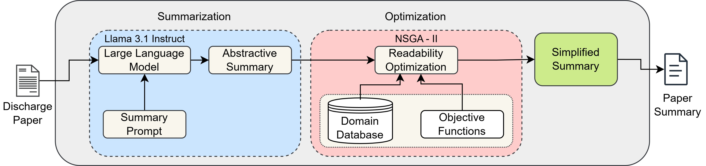

# OptiMDS
Multi-Objective Optimization of Large Language Model Summaries for Clinical Text Narratives
A framework that combines Large Language Models (LLMs) and multi-objective evolutionary optimization to improve the readability of domain-specific text summaries while preserving semantic fidelity.

## ⚙️ Tech Stack


> ⚠️ **Cite This Work:**  
> Verma, Deepika, Daison Darlan, and Rammohan Mallipeddi. "Multi-Objective Optimization of Large Language Model Summaries for Clinical Text Narratives." IEEE Access (2026). (https://ieeexplore.ieee.org/stamp/stamp.jsp?arnumber=11359644)

## 🧠 Readability Optimization for Medical Summaries using LLaMA 3.1 and NSGA-II

This repository implements a two-stage framework for improving the accessibility of complex clinical narratives generated by large language models.

While LLMs can generate high-quality summaries of medical documents, their outputs often remain too complex for non-expert readers. This work addresses that challenge by **introducing a multi-objective optimization framework that systematically simplifies LLM-generated summaries while maintaining their essential clinical meaning**.

The proposed approach integrates:
- LLaMA 3.1 Instruct for abstractive summarization
- NSGA-II (Non-dominated Sorting Genetic Algorithm II) for multi-objective optimization
- Lexical substitution strategies using WordNet and semantic embeddings

The framework balances two competing objectives:

1️⃣ Improving readability of generated summaries
2️⃣ Preserving semantic fidelity to avoid altering medical meaning

Although the experiments focus on clinical discharge summaries, the methodology is general and can be applied to domain-specific text simplification tasks across other technical fields.



---

## 🔍 Project Overview

The system consists of two main stages.

### 1️⃣ Summarization Module

The first stage generates a concise narrative summary from a medical discharge document.

- Uses **LLaMA 3.1 Instruct** via Hugging Face.
- Produces a structured paragraph-style summary of the clinical note.
- Serves as the base text for subsequent readability optimization.

Key idea:  
LLMs provide strong summarization capabilities but may still produce **linguistically complex outputs** that are difficult for patients or lay readers to understand.

---

### 2️⃣ Optimization Module

The second stage applies **multi-objective evolutionary optimization** to improve readability while preserving meaning.

We formulate the problem with two objectives:

**Objective 1 — Semantic Preservation**
Minimize the number of word substitutions to maintain clinical accuracy.

**Objective 2 — Readability Improvement**
Minimize the **Flesch–Kincaid Grade Level (FKGL)** to simplify language complexity.

Optimization is performed using **NSGA-II**, which generates a **Pareto set of optimized summaries** representing different trade-offs between readability and fidelity.

---

### 🔄 Lexical Substitution Strategies

Two alternative synonym generation strategies are implemented:

**1. WordNet-based substitution** 
- Uses **WordNet synsets** to identify semantically related replacements.
- Provides structured semantic relationships.
- Produces stronger readability improvements in experiments.

**2. Word2Vec-based substitution**
- Uses **distributional similarity** from Word2Vec embeddings.
- Captures contextual similarity between terms.
- May better preserve subtle semantic nuances.

---

### 📊 Evaluation Metrics

Readability improvements are evaluated using widely used readability indices:

- **FKGL** — Flesch-Kincaid Grade Level  
- **ARI** — Automated Readability Index  
- **DCRF** — Dale-Chall Readability Formula  
- **SMOG Index** — Simple Measure of Gobbledygook  

These metrics quantify the **linguistic complexity of text** based on sentence length, word complexity, and syllable counts.

---

## 📦 Installation

1. Clone the repository:
   ```bash
   git clone https://github.com/the-pika/OptiMDS.git
   cd OptiMDS

2. Install dependencies:
   ```bash
   pip install -r requirements.txt
  
💡 Note: Ensure you have a Hugging Face token set up for LLaMA model access.

---

# Running the Framework

**Step 1 — Generate LLM summaries**

Use the summarization module to generate summaries from discharge notes.

**Step 2 — Run optimization**
Example with WordNet:
    python OptiMDS_wordnet.py

Example with Word2Vec:
    python OptiMDS_word2vec.py

The algorithm will generate optimized summaries across different Pareto-optimal trade-offs between readability and semantic preservation.

---

# 📈 Key Contributions

This work introduces:

- A two-stage LLM + evolutionary optimization framework for domain-specific text simplification
- A multi-objective formulation balancing readability and semantic fidelity
- A comparative analysis of lexical substitution strategies (WordNet vs Word2Vec)
- An open-source implementation and medical-to-layperson terminology resource

The framework demonstrates how evolutionary optimization can improve the accessibility of LLM-generated summaries in technical domains.

---

# 🔬 Datasets

Experiments were conducted using clinical discharge notes from the **MIMIC-IV Clinical Database**. To use the same dataset, you must complete 2 certifications from the organization responsible for the dataset. 

The dataset information is given below:

**citation**

Johnson, Alistair, et al. "MIMIC-IV-Note: Deidentified free-text clinical notes" (version 2.2). PhysioNet (2023). RRID:SCR_007345. https://doi.org/10.13026/1n74-ne17

Link - https://mimic.mit.edu/docs/iv/modules/note/
 
The selected summaries in our experiments cover multiple medical conditions (e.g., fractures, cancer, ulcers), providing diverse clinical narratives for evaluation.

The dataset we created for the medical terminology repalcement is in data/medical_layman_dataset.

---

👩‍💻 Author

Deepika Verma

AI Researcher | NLP | Generative AI | Optimization
